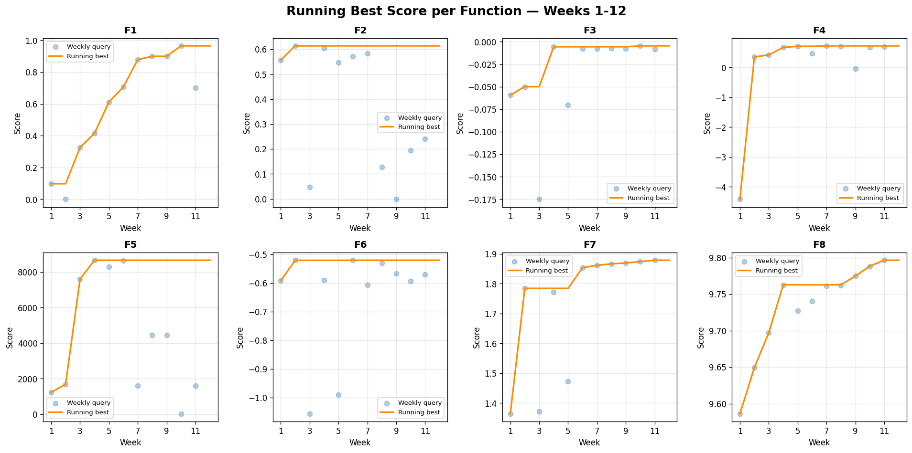

# Bayesian Optimization Capstone Project

> GP-Guided Hybrid Sequential Optimiser for Black-Box Functions

**[Model Card](BBO_Model_Card.md)** | **[BBO Datasheet](BBO_Datasheet.md)** | **[Presentation](BBO_Presentation.md)**

---

## Overview

This project tackles the **Black-Box Optimization (BBO) challenge**: maximising eight unknown functions (2D to 8D) with no access to equations, derivatives, or internal structure. One query per function per week over 12+ weeks, using Gaussian Process surrogate models and acquisition functions to balance exploration and exploitation.

## Results



| Function | Dims | Best Score | Best Week | Trend |
|----------|------|-----------|-----------|-------|
| 1 | 2D | 0.965 | W10 | 7 improvements via alternating-dim nudges; W11 dim1 overshoot |
| 2 | 2D | 0.614 | W2 | Stuck — searching for second peak reported by peers |
| 3 | 3D | -0.0046 | W10 | Plateau broken by dim3 increase; W11 overshot, W12 halved step |
| 4 | 4D | 0.724 | W7 | Volatile — EI failed twice (W6, W9), manual nudges work |
| 5 | 4D | 8662 | W4 | Corner optimum [1,1,1,1] locked; symmetry confirmed |
| 6 | 5D | -0.521 | W6 | Noisy function (identical inputs gave different outputs) |
| 7 | 6D | 1.879 | W11 | **6 consecutive bests** via dim2 decrease |
| 8 | 8D | 9.796 | W11 | 3 consecutive wins via dim3 increase (fresh dimension) |

## Technical Approach

- **Surrogate model**: Gaussian Process with Matern 2.5 kernel and automatic relevance determination (ARD)
- **Acquisition functions**: Expected Improvement (EI), Upper Confidence Bound (UCB), Thompson Sampling
- **Diagnostics**: Per-dimension sensitivity analysis via GP kernel length scales
- **Strategy**: Hybrid — automated BO where GP is reliable, manual GP-informed nudges where it is not
- **Failure tracking**: All 96 previous submissions verified against each new proposal

### Strategy Evolution

| Phase | Weeks | Approach |
|-------|-------|----------|
| Automated BO | 1-4 | PCA exploration, then GP + EI/UCB/TS with sensitivity-driven tuning |
| Manual Override | 5-7 | Single-dim nudges guided by length scales, locked hyper-sensitive dims, peer intelligence |
| Experimental | 8-10 | Fresh dimension exploration, trust-region EI, bold step sizes, ultra-sensitive probes |
| Defensive Refinement | 11-12 | Halved step sizes after overshoots, peer-informed exploration, winning-direction preservation |

## Project Structure

```
├── BBO_Model_Card.md         # Model card
├── BBO_Datasheet.md          # Dataset documentation
├── BBO_Presentation.md       # Capstone presentation
├── utils/                    # GP fitting, sensitivity analysis, data management
├── initial_data/             # Seed data for all 8 functions
└── week 1/ ... week 12/      # Weekly notebooks, data (.npz), and reflections
```

## Getting Started

```bash
pip install -r requirements.txt
cd "week 12"
jupyter notebook week12_function_analysis.ipynb
```

Each notebook loads the previous week's data, adds results, and generates recommendations.

## Tools

Python 3.12 | scikit-learn | SciPy | NumPy | Matplotlib
